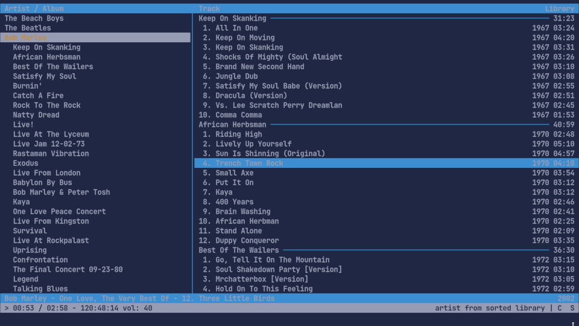

= MP3 tag with file name
:sectnums:

ifdef::env-github[]
++++

  

++++
endif::[]

ifndef::env-github[]

endif::[]

I have recently downloaded the discography of Bob Marley through torrent and there is all the metadata within the torrent file, but not in the mp3 one. My goal is to collect the file name to tag the mp3 files.

== My approach of creating my script

=== Find a scripting language

For this kind of use (file manipulation), the bash script is a good choice.

=== Collect data

=== Scanf

I already know about `scanf` function as I have used it in the C language. You give `scanf` a pattern` and it collects the data. I'm looking for something like `scanf` for bash script.

I found on https://www.reddit.com/r/bash/comments/gxygww/why_isnt_there_scanf_or_equivalent_in_bash/[reddit] an example.

[source, bash]
----
#!/bin/bash

pattern="Fan: (.+) rpm CPU die temperature: (.+) C"
if [[ "Fan: fann rpm CPU die temperature: 42 C" =~ $pattern ]]; then
    fan=${BASH_REMATCH[1]}
    cpu=${BASH_REMATCH[2]}
fi
echo "$fan" "$cpu"
----

[quote]
I use https://www.shellcheck.net/[shellcheck] to get good practices for creating shell scripts.

=== A loop through each file

I need a loop through each file. I found an example on https://w3guides.com/tutorial/bash-for-each-file-in-folder#bash-for-each-file-in-folder[w3guides.com]

[source, bash]
----
#!/bin/bash

for filename in ./*; do
    echo "${filename}"
done
----

=== Parse the filename

For each track on an album, we have to collect:

* The title
* The track number

We already have:

* The artist
* The album
* The yar

Example of filename for `Keep On Skanking`:

----
01 - All In One.mp3
02 - Keep On Moving.mp3
03 - Keep On Skanking.mp3
04 - Shocks Of Mighty (Soul Almighty Ve.mp3
05 - Brand New Second Hand.mp3
06 - Jungle Dub.mp3
07 - Satisfy My Soul Babe (Version).mp3
08 - Dracula (Version).mp3
09 - Vs. Lee Scratch Perry Dreamland (Featuring Bunny Wailer).mp3
10 - Comma Comma.mp3
----

=== awk

After, a few researches I once again found this dark tool. I have had chosen to never learn to use this, because it's a very hard tool.

[source,man]
----
NAME
       awk — pattern scanning and processing language
----

==== 2.4.1 Print the track number

For each `.mp3` files:

[source, bash]
----
#!/bin/bash

for filename in ./\.*mp3; do
    echo "${filename}"
    echo "${filename}" | \
		awk '{printf "Track number: %d\n", substr($1, 3)}'
done

# OUTPUT:
# ./01 - All In One.mp3
# Track number: 1
----

If I take this filename as example `./01 - All In One.mp3`. The first element is `./01`. I have to do a substring, so begin my substring to the third character.

[quote]
I find it weird, this time the index start with 1 and not 0.

With the substring I get `01` instead of `./01`. And then I use `%d` of `printf` for convert to a number.

==== Print the track title

[source,bash]
----
#!/bin/bash

for filename in ./*\.mp3; do

    echo "${filename}"
    echo "${filename}" | \
		awk '{printf "Titel: " }{i = 3} \
		{while (i + 1 <= NF ) {printf "%s ", $i; i++}} \
		{printf "%s\n", substr($i, 0, length($i) - 4)}'
done

# OUTPUT:
# ./01 - All In One.mp3
# Title: All In One
----

1. Just print `"Title: "`.
2. Set `i = 3`.
3. `While (i + 1 <= NF)` print each element.

[quote]
NF: The number of fields in the current record.

[start=4]
4. Remove `./mp3`: Substing of the last element, start a the beginning of the string, stop at the end minus four.

== Tag the track

It's the simplest step, after saving `track` and `title`. Just use `mp3info` for tagging them.

[source,bash]
----
#!/bin/bash

for filename in ./*\.mp3; do

    track=$(echo "${filename}" | awk '{printf "%d", substr($1, 3)}')
    title=$(echo "${filename}" | \
		awk '{i = 3} {while (i + 1 <= NF ) {printf "%s ", $i; i++}} \
		{printf "%s", substr($i, 0, length($i) - 4)}')
    printf "Track: %s\tTitle: %s\n" "${track}" "${title}"
    mp3info -t "${title}" -n "${track}" "${filename}"
done
----

== Bonus: Collect the folder data

We have to collect from the folder

* The artist
* The year of the album
* The album name

The tracks are tidied up like this:
----
Bob Marley - 1967 - Keep On Skanking
├── 01 - All In One.mp3
├── 02 - Keep On Moving.mp3
└── [...]
Bob Marley - 1970 - African Herbsman
├── 01 - Riding High.mp3
├── 02 - Lively Up Yourself.mp3
└── [...]
----

For remove the `./` or `./${foldername}`, we can use `basename`.

== The final script

[source,bash]
----
#!/bin/bash

for folder in ./Bob*; do

    folder=$(basename "${folder}")
    artist="Bob Marley"
    year=$(echo "${folder}" | awk '{printf "%d", $4}')
    album=$(echo "${folder}" | awk '{i = 6} {while (i <= NF ) {printf "%s ", $i; i++}}')

    for filepath in "${folder}"/*\.mp3; do

        filename=$(basename "${filepath}")

        track=$(echo "${filename}" | awk '{printf "%d", $1}')
        title=$(echo "${filename}" | \
		awk '{i = 3} {while (i + 1 <= NF ) \
		{printf "%s ", $i; i++}} \
		{printf "%s", substr($i, 0, length($i) - 4)}')

        mp3info -a "${artist}" \
			-l "${album}" \
			-y "${year}" \
			-t "${title}" \
			-n "${track}" "${filepath}"

        echo mp3info -a "${artist}" \
			-l "${album}" \
			-y "${year}" \
			-t "${title}" \
			-n "${track}" "${filepath}"
    done
done
----

== Conclusion

As I said `awk` is a dark and a complicated tool. But after spending a few hours reading manuals and manipulating `awk`, I got comfortable with it. With this project I learned basics of `awk` and new knowledge on `AsciiDoc` and `bash`.

=== The real conclusion

All the Bob Marley's tracks are tagged and tidied !

== Other

=== Pattern matching

1. Use the bash shell
2. Enable the `extglob`
[source,bash]
----
shopt -s extglob
----

[start=3]
3. Try to list all but not MP3 files with
[source,bash]
----
ls !(*.mp3)
----
